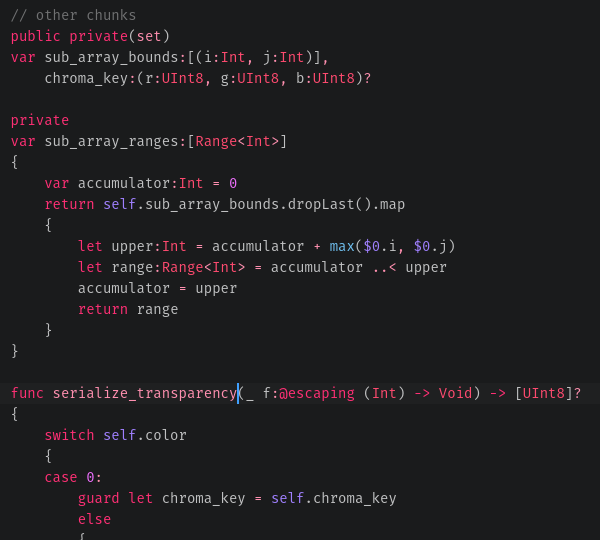
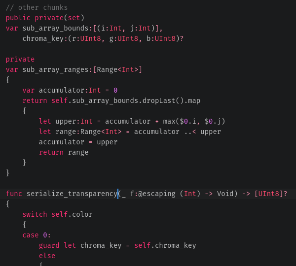

# language-swift-89

Correct Swift syntax highlighting in Atom. This language package corrects a great many of the bugs in the [`language-swift3`](https://atom.io/packages/language-swift-3) package, and includes all the keywords, syntax, and [standard library symbols](https://developer.apple.com/reference/swift) that are missing from that package. 

The old `language-swift3` package for comparison:

